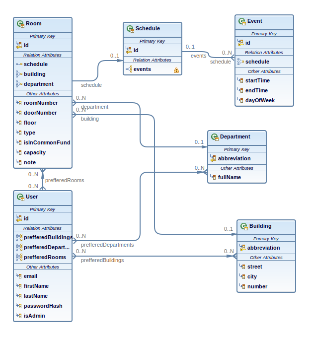

# Where2Study

Application which facilitates access to information about free rooms at the Palacky University.

## Features:

* Uses STAG API to access information about rooms and schedules
* Keeps inner representation of obtained data to make its usage easier for providing information about free rooms
* Persists data using JPA
* Provides basic user customization – users can select which building, departments or rooms they prefer
* User administration – users can edit information about themselves including email, first name, last name and password
* Examples of RESTful services, which can be further expanded to accommodate native mobile clients

## Developer environment

Application was developed using JBoss Developer Studio and Wildfly 11

## How to deploy

The only deploy which I made was using EAR project embedded in Eclipse/JBDS. There was plan to introduce maven build to EAR.

1. Open Eclipse/JDBS
1. Create new EAR project and make `where2study-ejb` and `where2study-war` its modules
1. Start SQL server, preferably using attached `docker-compose.yml` file by running `sudo docker-compose up`
1. Deploy EAR on server
1. Open page which appeared under "...registered web context.." in server's console in web browser
1. Register first user by clicking "Register" on top right
1. Edit user's privilege in database using yours favorite tool (e.g. MySQL Workbench) by updating value in `isAdmin` from 0 to 1
1. Edit user's preferences in application and click button labeled "Download all data"
1. After the client receives response, all data should be already persisted in inner representation

## Database schema

## Update data

In case there are new version of data in STAG you can log in to your administrator's account again and click on the "Remove all data" button and then on "Download all data" button. This will perform refresh on persisted data.
